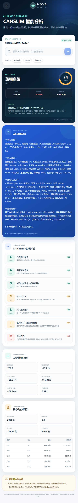

<div align="center">
  <strong>English</strong> · <a href="README.zh-CN.md">简体中文</a>
</div>

# Nova Trade AI

Nova Trade AI is a mobile-first, open-source AI stock research platform featuring CANSLIM analysis powered by real financial data, DeepSeek research insights, streaming AI chat, user accounts, and conversation history.

The project uses a decoupled frontend/backend architecture and includes Docker Compose for launching the Vue H5 frontend, Spring Boot backend, and PostgreSQL database together.

## Features

- Intelligent stock analysis: symbol search, quotes, financial statements, seven-factor CANSLIM scoring, and risk disclosures
- AI research insights: cautious Chinese research summaries generated from structured analysis data
- AI chatbot: SSE streaming responses, multiple conversations, and message history
- User system: registration, login, profile management, password changes, and token authentication
- Mobile H5 workspace: stock analysis and AI chat on the home screen, with profile data on a dedicated page
- Containerized deployment: one-command orchestration for Nginx, Spring Boot, and PostgreSQL

## Demo

<p align="center">
  
</p>

## Tech Stack

- Backend: Java 21, Spring Boot 4.1, Spring AI 2.0, MyBatis-Plus
- Frontend: Vue 3, Vue Router, Vite, Nginx
- Database: PostgreSQL 17
- External services: DeepSeek API and Tonghuashun financial data (Fuyao) API

## One-Command Linux Setup

### 1. Requirements

Prepare a Linux host with:

- Git
- Docker Engine
- Docker Compose v2 plugin, using the `docker compose` command

Verify the installation:

```bash
docker --version
docker compose version
git --version
```

If the current user cannot access Docker, run Compose with `sudo` or add the user to the `docker` group and sign in again:

```bash
sudo usermod -aG docker "$USER"
```

### 2. Configure the environment

Copy the environment template:

```bash
cp .env.example .env
```

Edit `.env` and configure at least these two API keys:

```dotenv
DEEPSEEK_API_KEY=your_DeepSeek_API_key
FUYAO_API_KEY=your_Fuyao_API_key
```

The containers can start without these keys, but the corresponding AI or stock analysis features will be unavailable.

You should also replace the default database password:

```dotenv
POSTGRES_PASSWORD=replace_with_a_strong_password
```

### 3. Start all services

```bash
docker compose up --build -d
```

After startup:

- H5 frontend: `http://<linux-server-ip>:3100`
- Backend API, bound to the server only: <http://127.0.0.1:18080>
- PostgreSQL, bound to the server only: `127.0.0.1:15432`

If UFW is enabled, allow the H5 port:

```bash
sudo ufw allow 3100/tcp
```

The first database initialization creates this default user:

| Username | Password |
| --- | --- |
| `admin` | `admin123` |

Change the default password immediately after signing in.

### 4. View logs and stop services

```bash
docker compose logs -f
docker compose down
```

To delete the database volume and run `sql/init.sql` again:

```bash
docker compose down -v
docker compose up --build -d
```

> `docker compose down -v` permanently removes the database data stored in the current Compose volume. Back up important data first.

## Configuration

All secrets and environment-specific settings are injected from the root `.env` file. `.env` is ignored by Git; never commit real API keys.

| Environment variable | Default | Description |
| --- | --- | --- |
| `WEB_PORT` | `3100` | Public H5 port |
| `BACKEND_PORT` | `18080` | Backend port exposed on localhost |
| `POSTGRES_EXPOSE_PORT` | `15432` | PostgreSQL port exposed on localhost |
| `POSTGRES_DB` | `nova_trade` | Database name |
| `POSTGRES_USER` | `nova` | Database user |
| `POSTGRES_PASSWORD` | `nova_change_me` | Database password; change it before public deployment |
| `DEEPSEEK_BASE_URL` | `https://api.deepseek.com` | DeepSeek API base URL |
| `DEEPSEEK_API_KEY` | `not-configured` | DeepSeek API key |
| `DEEPSEEK_MODEL` | `deepseek-v4-flash` | Model used by AI chat and stock research insights |
| `DEEPSEEK_TIMEOUT` | `30s` | DeepSeek request timeout |
| `DEEPSEEK_TEMPERATURE` | `0.7` | Model temperature |
| `DEEPSEEK_MAX_TOKENS` | `2048` | Maximum tokens per generation |
| `FUYAO_BASE_URL` | `https://fuyao.aicubes.cn` | Fuyao API base URL |
| `FUYAO_API_KEY` | `not-configured` | Fuyao API key |
| `FUYAO_TIMEOUT` | `15s` | Fuyao request timeout |

Recreate the containers after changing `.env`:

```bash
docker compose up --build -d --force-recreate
```

## Container Architecture

```text
Browser :3100
    │
    ▼
Nginx / Vue H5 ── /api ──▶ Spring Boot :8080 ──▶ PostgreSQL :5432
                                      │
                                      ├──▶ DeepSeek API
                                      └──▶ Fuyao Financial Data API
```

Nginx forwards `/api` requests to the backend and disables proxy buffering for SSE-based AI streaming. PostgreSQL and the backend API are bound to localhost, while containers communicate over the internal Compose network.

## Local Development

The following commands target Linux development environments. Install JDK 21, Node.js 22, npm, and PostgreSQL first.

### Backend

Prepare PostgreSQL, configure the `POSTGRES_*`, `DEEPSEEK_*`, and `FUYAO_*` environment variables, then run:

```bash
chmod +x mvnw
./mvnw spring-boot:run
```

Run backend tests:

```bash
./mvnw test
```

### Frontend

```bash
cd web
npm install
npm run dev
```

The development server runs at <http://localhost:5173> and proxies `/api` to <http://localhost:8080> by default.

Create a production build:

```bash
cd web
npm run build
```

## Project Structure

```text
.
├── src/                 Spring Boot backend
├── web/                 Vue H5 frontend and Nginx configuration
├── sql/init.sql         PostgreSQL initialization script
├── APIDoc/              API and data source documentation
├── Dockerfile           Backend image build
├── compose.yaml         Three-service orchestration
├── .env.example         Environment variable template
├── README.md            English documentation
├── README.zh-CN.md      Simplified Chinese documentation
└── LICENSE              MIT License
```

## API Documentation

- [CANSLIM Stock Analysis API](APIDoc/CANSLIM股票分析接口.md)
- [Tonghuashun Financial Data API Reference](APIDoc/同花顺金融数据%20API%20文档.txt)

## Security

- Never commit `.env`, real API keys, production database passwords, or access tokens.
- Rotate any key that has ever appeared in Git history; removing it from the latest file does not remove it from history.
- The default administrator account is intended for initial evaluation only. Change its password immediately after deployment.
- This project is intended for research and technical demonstration and does not constitute investment advice.

## License

This project is available under the permissive and widely adopted [MIT License](LICENSE). You may use, modify, and distribute the software as long as the original copyright and license notice are retained.
